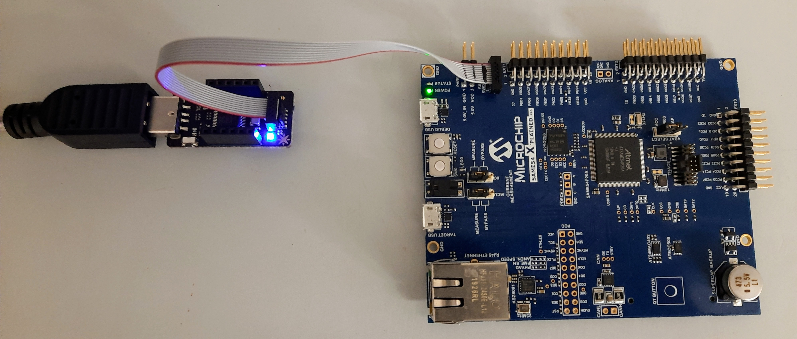
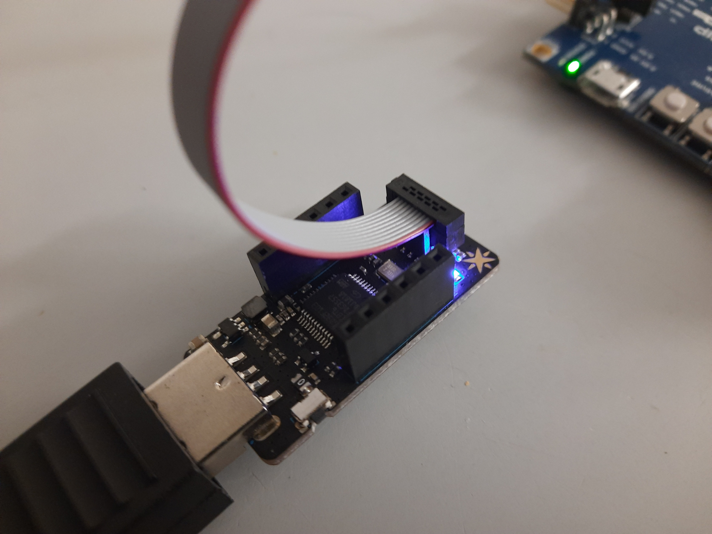
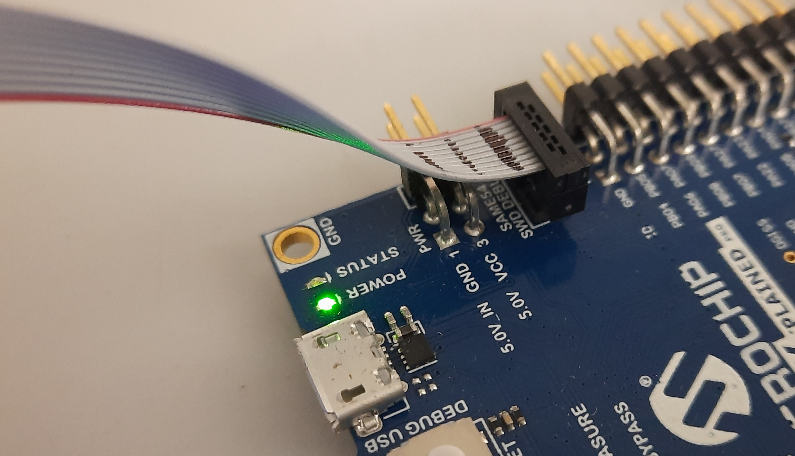

# Test Plans for ATSAME54 Xplained

Example PLT test plan for Microchip's
**ATSAME54 Xplained** evaluation kit.

- [suite-atsame54\_xpro-blinky-DAP.yaml](suite-atsame54_xpro-blinky-DAP.yaml): Program ATSAME54 using USB-attached CMSIS-DAP programmer
- `zephyr-atsame54_xpro-sample-blinky-2.4.0.hex`: Zephyr "blinky" sample for ATSAME5 Xplained.

## ACC-DEBUG connection

We recommend using the
[Particle Debugger](https://docs.particle.io/datasheets/accessories/debugger/) (ACC-DEBUG)
as the CMSIS-DAP programmer.

Use a 10-lead 0.1" ribbon cable to connect the "SAME54 SWD DEBUG" connector
of the SAME54 Xplained board with the ACC-DEBUG programmer.

## References

- [SAM E54 XPLAINED PRO EVALUATION KIT | Microchip Technology](https://www.microchip.com/en-us/development-tool/atsame54-xpro)
