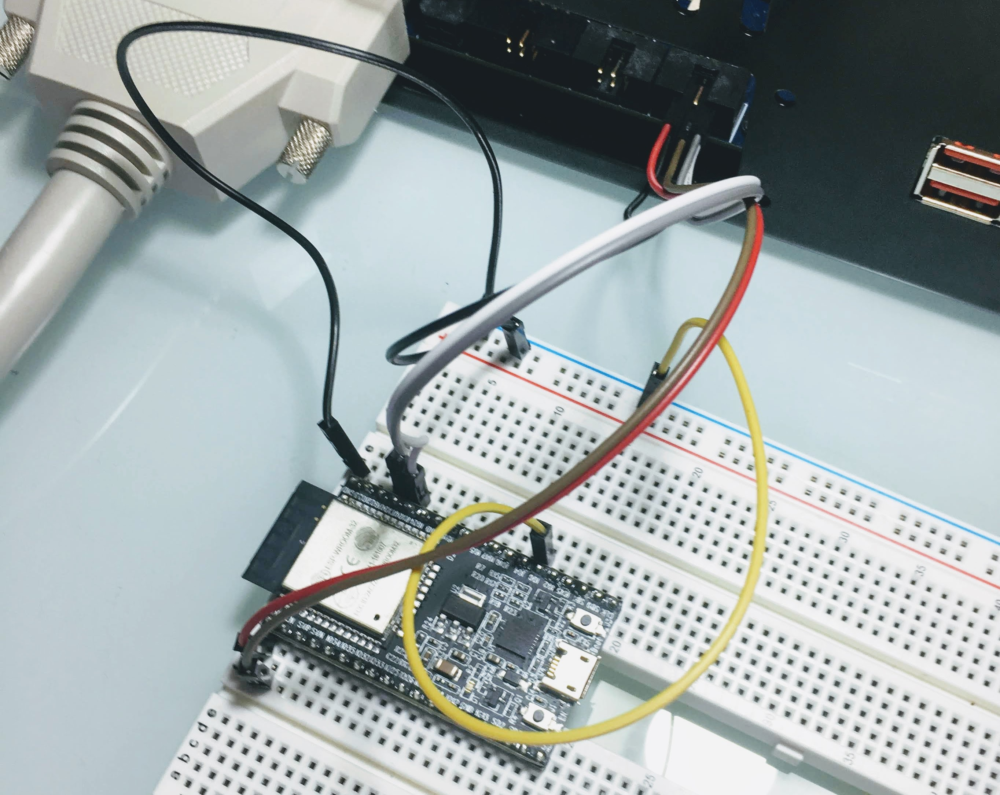

# Test Plans for Espressif ESP32-DevKitC modules

Example PLT test plan for Espressif's
**ESP32-DevKitC** development board.

- [esp32-identify-program-uart0.yaml](esp32-identify-program-uart0.yaml): Identify and program ESP32 over UART0
- [esp32-wroom-32_hello_world_zephyr_2.7.0.bin](esp32-wroom-32_hello_world_zephyr_2.7.0.bin): Zephyr RTOS hello world sample for ESP32
- [esp32-wroom-32_bootloader.bin](esp32-wroom-32_bootloader.bin): ESP32 example bootloader
- [esp32-wroom-32_partitions_singleapp.bin](esp32-wroom-32_partitions_singleapp.bin): ESP32 example partition table

## PLT Signals
| PLT           | UART/TP pin | ESP32             |
|---------------|:-----------:|-------------------|
| UART0\_RXD    | 1           | ESP32:TXD (GPIO1) |
| UART0\_TXD    | 2           | ESP32:RXD (GPIO3) |
| UART0\_CTS    | 3           | n.c.              |
| UART0\_RTS    | 4           | ESP32:EN          |
| UART0\_VDD    | 5           | ESP32:3V3         |
| GND           | 6           | ESP32:GND         |
| GND           | 6           | ESP32:GPIO0       |

## PLT-200A connection

## References

- [ESP32-DevKitC - Espressif Systems](https://www.espressif.com/en/products/hardware/esp32-devkitc/overview)
- [Zephyr RTOS Hello World Sample](https://docs.zephyrproject.org/latest/samples/hello_world/README.html)
- [Zephyr RTOS ESP32 Support Information](https://docs.zephyrproject.org/latest/boards/xtensa/esp32/doc/index.html)
