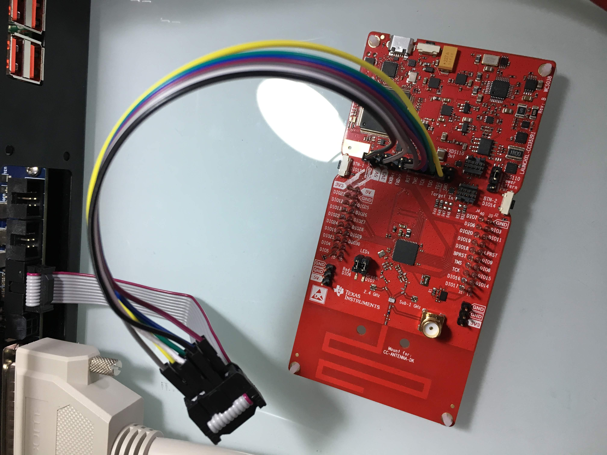

# Test Plans for TI CC1352

Example PLT test plan for TI's
**CC1352R1 LaunchPad** evaluation kit.

- [cc1352-program.yaml](cc1352-program.yaml): Program CC1352 over JTAG
- `sensor_default_cc1352r1lp.hex`: Example CC1352 firmware, available from TI.

## PLT-200A connection

| PLT-200A signal | PLT-200A JTAG pin | CC1352  |
|-----------------|:-----------------:|---------|
| JTAG\_TMS       | 2                 | TMS     |
| GND             | 3                 | GND     |
| JTAG\_TCK       | 4                 | TCK     |
| JTAG\_VCC       | 5                 | 3V3     |
| JTAG\_TDO       | 6                 | TDO     |
| JTAG\_TDI       | 8                 | TDI     |
| JTAG\_TRST      | 10                | RST     |

## References

- [LAUNCHXL-CC1352R1 SimpleLink™ Multi-Band CC1352R Wireless MCU LaunchPad™ Development Kit | TI.com](http://www.ti.com/tool/LAUNCHXL-CC1352R1)
