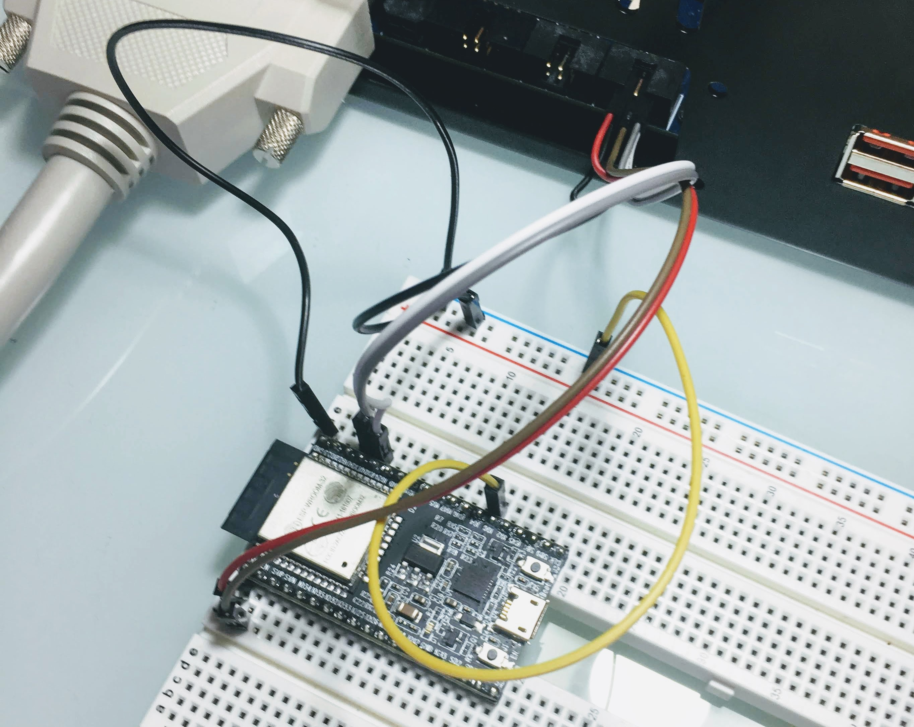

# Test Plans for Espressif ESP32-DevKitC modules

- [esp32-identify-uart0.yaml]: Identify ESP32 over UART0

## PLT-200A connection

| PLT-200A      | UART/TP pin | ESP32             |
|---------------|:-----------:|-------------------|
| UART0\_RXD    | 1           | ESP32:TXD (GPIO1) |
| UART0\_TXD    | 2           | ESP32:RXD (GPIO3) |
| UART0\_CTS    | 3           | n.c.              |
| UART0\_RTS    | 4           | ESP32:EN          |
| UART0\_VDD    | 5           | ESP32:3V3         |
| GND           | 6           | ESP32:GND         |
| GND           | 6           | ESP32:GPIO0       |
